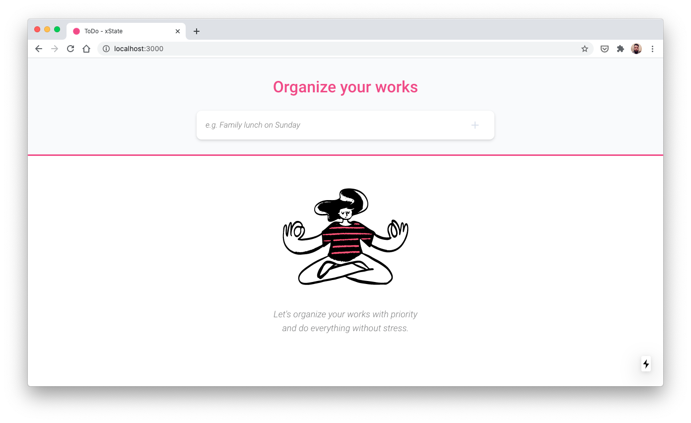

<h1 align="center">
  
</h1>

<h1 align="center">
  Todo with xState
</h1>
<p align="center">Basic study using xState</p>

<p align="center">
  <a href="https://todo-mvc-tau.vercel.app/">Link to Preview</a>
</p>

<p align="center">
 <a href="#technology">Technology</a> •
 <a href="#author">Autor</a>
</p>

### Getting Started

```bash
# First, clone this repository:
$ git clone https://github.com/mateusdotcc/todo-mvc.git

# Access the project folder in the / cmd terminal:
$ cd todo-mvc

# Install the dependencies:
$ yarn or npm i

# Run the application in development mode:
npm run dev or yarn dev

# The server will start at port: 3000 go to:
http://localhost:3000
```

### Technology

---

- [Node.js](https://nodejs.org/en/)
- [NextJS](https://nextjs.org/)
- [React](https://pt-br.reactjs.org/)
- [xState](https://xstate.js.org/)
- [@xstate/react](https://github.com/davidkpiano/xstate/tree/master/packages/xstate-react)
- [TypeScript](https://www.typescriptlang.org/)
- [Axios](https://github.com/axios/axios)
- [Polished](https://polished.js.org/)
- [Styled Components](https://styled-components.com/)
- [UUID](https://www.npmjs.com/package/uuidv4)

### Author

---

<a href="http://mateus.cc/">
  

  <br>

  <sub>
    <b>Mateus Henrique</b>
  </sub>
</a>

[](https://www.linkedin.com/in/mateusdotcc/)
